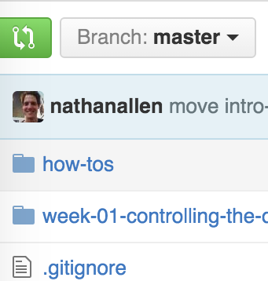
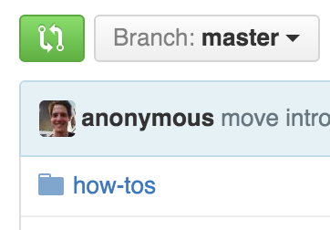
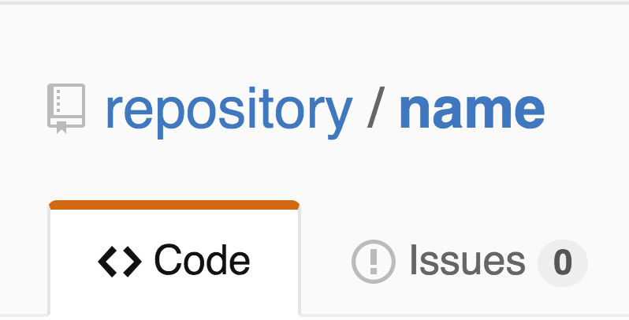
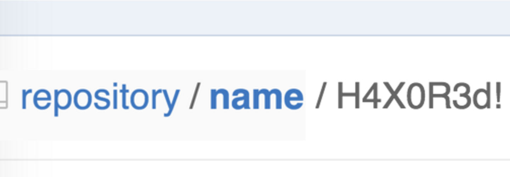

# jQuery & DOM Exercises

#### Nature Drawing 101: Draw a Tree! - [solutions](solutions.md)
1. Draw the structure (DOM tree) of the following HTML document:

``` html
<!DOCTYPE html>
<html>
  <head>
    <title>My Site</title>
  </head>
  <body>
    <header>
      <ul>
        <li><a href="/">Home</a></li>
        <li><a href="/about">About</a></li>
        <li><a href="/contact">Contact</a></li>
      </ul>
    </header>

    <section>  
      <h1>Welcome to my site!</h1>
      
      <p>Words and <a href="/">links</a></p>
    </section>

    <footer>
      <small>Copyright 2015 Jon Doe.</small>
    </footer>
  </body>
</html>
```

* How many children does `header` have?
* Name a direct child of the `p` element.
* Name a direct parent of the `p` element
* What is the parent of the `html` element?

#### CSS Selector Challenge - [solutions](solutions.md)
Please refer to [this google doc](https://docs.google.com/document/d/1sKbuZaSio1o65iRdkNpB03pwJfJj98GPHUJQsoKJmE4/edit?usp=sharing).

For each page, come up with as many CSS Selectors as you can think of to select the html elments in **red**, and *only* the elements in red.

#### Indiana Jones And the Temple of DOM - [solutions](solutions.md)

Go to the [General Assembly homepage](https://generalassemb.ly/) and open your Chrome Developer Console. Follow the instructions by editing the DOM using jQuery in the console.

1. Grab the huge text splashed across the front page.
    * Get its current text.
        * Change it to "Indiana Jones and the Temple of DOM"
    * Add a `small` tag containing the text "(Rated G)" at the end of the line.
1. Turn the big red button blue.
1. Change the background of the first section heading to yellow.
1. Make the GA icon 100 pixels tall.
1. Grab the first big image on the right (the one with the red-cushioned chair).
    * Get its current image src. (image url)
    * Swap it for this GIF of [Indiana Jones](http://media2.giphy.com/media/MS0fQBmGGMaRy/giphy.gif).
1. Change the text of *only* the first paragraph to: "Snakes. Why did it have to be snakes?"
    * Now, change the text of *every* paragraph to the same quote.

1. Bonus: Combine all your code into a single function called `changeAllTheThings`. When you call the function, it should make all your changes to the page.


# Exercise - Hack Github with jQuery!
Each exercise will require you to use your ninja jQuery skills to alter the wdi-27 or wdi-28 schedule repository page.  In your `solutions.md` file, include your jQuery code snippet with the associated challenge number.

We highly suggest that you complete all of the challenges using the following jQuery methods:

 - `.text()`
 - `.html()`
 - `.append()`
 - `.addClass()`
 - `.removeClass()`
 - `.hide()`
 - `.show()`
 - `.toggleClass()`

## Challenge 1 - Name Changer
Change the name of the repository author (in this current case, nathanallen to `anonymous`

#### Before  


<br>

#### After



<br><br><br>
## Challenge 2 - Add some class
Add the `btn-primary` class to all of the buttons on the screen.  This should make them all green.

#### Before


<br>

#### After


<br><br><br>
## Challenge 3 - It's Shruggy!
Change all of the commit messages to shruggy ¯\\_(ツ)_/¯

#### Before


<br>

#### After


<br><br><br>
## Challenge 4 - I'm the captain now.
Remove the user links on the top right of the screen.

#### Before


<br>

#### After


<br><br><br>
## Challenge 5 - One big family
Change the values of the Watch, Star, and Fork social count all to ∞ (infinity).

#### Before


<br>

#### After


<br><br><br>
## Challenge 6 - JustinHub!
Change the Octocat logo/link at the top right of the page to a picture of Justin.  Use the linked image here:
 `https://avatars2.githubusercontent.com/u/4304660?v=3&s=40`

*Stretch: If you want to get real fancy, try to change the octocat to YOUR github profile photo!*  

#### Before


<br>

#### After


<br><br><br>
## Challenge 7 - Nuclear Option
Add a completely useless button that says `Delete Repository` to the right of the Fork button.

*Stretch: Add your own glyphicon to your custom-made button!*

#### Before


<br>

#### After


<br><br><br>
## Challenge 8 - Ugh, script kiddies
Add a folder to the notes file system display named "H4X0R3d!"

#### Before


<br>

#### After

